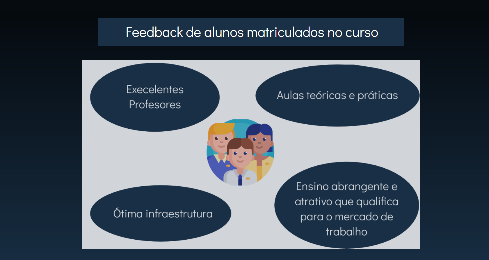

# Redes One Page
Site one page sobre o curso técnico de Redes de Computadores, com fins didáticos, para o curso de desenvolvimento de sistemas do [SENAI Jandira](https://jandira.sp.senai.br/), sobre orientação do professor [Fernando Leonid](https://github.com/fernandoleonid).

## Objetivo do exercício

Realizar o desenvolvimento dasOne Page sobre o curso técnico de Redes de Computadores a partir de um planejamento feito no figma.

## Website

A galeria pode ser acessada pelo link: [vitoraguiarc](https://vitoraguiarc.github.io/redes-one-page/)

## Tecnológias

- HTML5
- CSS3
- VSCODE

## Screenshot

